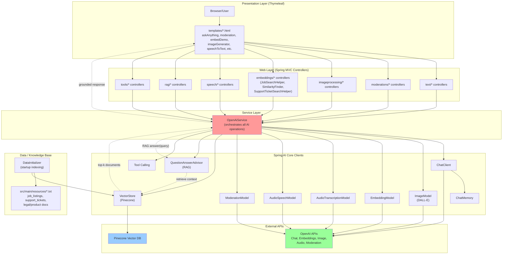

# Spring AI Demo Project

A Spring Boot + Spring AI reference application with multiple AI use-cases (text, image, speech, moderation, embeddings, and RAG-style search helpers).

This README is designed so someone can clone the repo, run it locally, and use it as a development reference.

## What this project includes

Based on the current project structure, this app includes:

### 1. **Spring Boot web app with Thymeleaf UI pages**
   - **Folder:** `src/main/resources/templates/`
   - **Description:** Server-rendered HTML pages using Thymeleaf templating engine.
   - **Templates include:** index.html (home), askAnything.html, imageGenerator.html, imageAnalyzer.html, speechToText.html, textToSpeech.html, moderation.html, embedDemo.html, similarityFinder.html, and domain-specific helpers.

### 2. **OpenAI-backed chat/completion style flows**
   - **Folder:** `src/main/java/com/example/springai/text/`
   - **Description:** Controllers and services that call OpenAI Chat Completion API for general-purpose text generation and question answering.
   - **Key class:** Look for `*Controller.java` files that map HTTP endpoints to OpenAI calls.

### 3. **Image generation and image analysis helpers**
   - **Folder:** `src/main/java/com/example/springai/imageprocessing/`
   - **Description:** Controllers and services for:
     - Generating images using OpenAI's DALL-E API
     - Analyzing/describing user-uploaded images
   - **Templates:** `imageGenerator.html`, `imageAnalyzer.html`

### 4. **Speech-to-text and text-to-speech helpers**
   - **Folder:** `src/main/java/com/example/springai/speech/`
   - **Description:** Controllers and services for:
     - Converting audio input to text (speech recognition)
     - Converting text to audio output (voice synthesis)
   - **Templates:** `speechToText.html`, `textToSpeech.html`
   - **Static assets:** `src/main/resources/static/stream.html` (may handle real-time audio streams)

### 5. **Moderation flows**
   - **Folder:** `src/main/java/com/example/springai/moderations/`
   - **Description:** Services that check user input/output against OpenAI's moderation API to flag potentially harmful content.
   - **Template:** `moderation.html`

### 6. **Embeddings demos and similarity search flows**
   - **Folder:** `src/main/java/com/example/springai/embeddings/`
   - **Description:** 
     - Generate embeddings for text documents
     - Store embeddings in vector database (Pinecone)
     - Find similar documents by vector similarity
     - Classes: `EmbeddingDemo.java`, `SimilarityFinder.java`
   - **Templates:** `embedDemo.html`, `similarityFinder.html`

### 7. **Domain-specific helper pages (RAG-style Q&A)**
   - **Folder:** `src/main/java/com/example/springai/embeddings/` (search helpers) and `src/main/java/com/example/springai/rag/` (if RAG flow exists)
   - **Description:** 
     - Job search helper: Search through indexed job listings using embeddings
     - Support ticket search helper: Find similar support tickets
     - Legal/Product data bot: Q&A over documents (legal analysis, product info)
   - **Key classes:** 
     - `JobSearchHelper.java`
     - `SupportTicketSearchHelper.java`
   - **Templates:** 
     - `jobSearchHelper.html`
     - `supportTicketSearchHelper.html`
     - `legalDataBot.html`
     - `productDataBot.html`
   - **Data files:** 
     - `src/main/resources/job_listings.txt`
     - `src/main/resources/support_tickets.txt`
     - `src/main/resources/Legal_Document_Analysis_Data.txt`
     - `src/main/resources/product-data.txt`

### 8. **Pinecone vector-store integration**
   - **Folder:** Vector store integration is configured in `src/main/java/com/example/springai/config/` (or similar)
   - **Description:** 
     - Stores document embeddings in Pinecone (cloud vector database)
     - Enables similarity search across stored vectors
     - Used in job search, support ticket search, and legal/product Q&A flows
   - **Config:** Check `application.properties` for Pinecone API key and index configuration

### 9. **Supporting services and utilities**
   - **Folder:** `src/main/java/com/example/springai/services/`
   - **Description:** Core business logic, OpenAI API calls, vector store operations
   - **Key class:** `OpenAiService.java` (likely orchestrates most AI operations)
   - **Folder:** `src/main/java/com/example/springai/config/`
   - **Description:** Spring configuration classes (Bean definitions, properties loading, etc.)

### 10. **Application startup logic**
   - **Folder:** `src/main/java/com/example/springai/`
   - **Key files:**
     - `OpenaiDemoApplication.java` – main entry point with @SpringBootApplication
     - `DataInitializer.java` – loads sample data (job listings, documents) into Pinecone on startup

## Tech stack

- **Java 17** (configured in `pom.xml`)
- **Spring Boot 3.5.7** (parent POM)
- **Spring AI 1.1.2** (release version)
- Maven Wrapper (`./mvnw`)
- Thymeleaf 3.x for server-side templating
- Pinecone vector database integration
- OpenAI API (Chat, Image, Embeddings, Moderation, etc.)

## Architecture overview

This diagram shows how `OpenAiService` orchestrates different AI features (moderation, RAG, image processing, embeddings, speech, chat) through Spring AI clients and external APIs:



### Feature-to-OpenAiService method mapping

- **Chat & Text Generation:** `generateAnswer()`, `getTravelGuidance()`, `getInterviewPreparation()`, `streamAnswer()` → `ChatClient`
- **Moderation:** `moderate()` → `ModerationModel`
- **Image Processing:** `generateImage()`, `analyzeImage()`, `analyzeDietHelperImage()` → image models / multimodal chat
- **Embeddings & Vector Search:** `embed()`, `findSimilarity()`, `searchJobs()`, `searchTickets()` → embeddings + `VectorStore`
- **Speech:** `speechToText()`, `textToSpeech()` → audio transcription/speech models
- **Tool Calling:** `callAgent()` → tool-calling (e.g., Weather tools, Calculator)
- **RAG:** `answerLegal()`, `answerProduct()` → `QuestionAnswerAdvisor` + `VectorStore` for retrieval-augmented generation

## Project structure

Key paths:

- Main class: `src/main/java/com/example/springai/OpenaiDemoApplication.java`
- Java source root: `src/main/java/com/example/springai/`
- Templates: `src/main/resources/templates/`
- Static assets: `src/main/resources/static/`
- App config: `src/main/resources/application.properties`

## Main application class and package

Current main class is:

- `com.example.springai.OpenaiDemoApplication`

And file package declaration is:

```java
package com.example.springai;
```

If IntelliJ run configuration points to a different package/class, startup fails with:

- `Could not find or load main class ...`
- `ClassNotFoundException`

## Prerequisites

- **JDK 17** (or later, but pom.xml targets 17)
- **Maven 3.6+** (or use the included Maven Wrapper `./mvnw`)
- Internet access for OpenAI, Pinecone, and other APIs
- **API Keys required:**
  - OpenAI API key (for Chat, Embeddings, Image generation, Moderation, Speech, etc.)
  - Pinecone API key and index name (for vector store operations)
  - (Optional) Any other third-party service keys depending on enabled features

## Local setup

1. Clone the repository.
2. Open in IntelliJ IDEA.
3. Ensure Project SDK is Java 21.
4. Configure required API keys and model/vector settings in `application.properties` or environment variables.
5. Run from `OpenaiDemoApplication` or use Maven.

## Build and run

Use Maven wrapper from project root:

```bash
./mvnw clean compile
./mvnw spring-boot:run
```

Run tests:

```bash
./mvnw test
```

If Maven wrapper is not executable:

```bash
chmod +x mvnw
```

## IntelliJ run configuration checklist

When running from IntelliJ:

- Main class must be exactly: `com.example.springai.OpenaiDemoApplication`
- Use module classpath for this project
- JDK should be 17 (or later)
- Re-import Maven project after package/class moves

If still broken, do:

```bash
./mvnw clean
./mvnw compile
```

Then restart IntelliJ and re-run.

## Feature pages

Thymeleaf pages available under `src/main/resources/templates/` include examples such as:

- `askAnything.html`
- `imageGenerator.html`
- `imageAnalyzer.html`
- `speechToText.html`
- `textToSpeech.html`
- `moderation.html`
- `embedDemo.html`
- `similarityFinder.html`
- `jobSearchHelper.html`
- `supportTicketSearchHelper.html`
- `legalDataBot.html`
- `productDataBot.html`

Controller mappings are in Java packages under `src/main/java/com/example/springai/`.

## Known issues and troubleshooting

### 1) Main class not found

Error:

- `Error: Could not find or load main class com.example.springai.OpenaiDemoApplication`

Checks:

- Verify file path and package declaration match.
- Ensure IntelliJ run config references `com.example.springai.OpenaiDemoApplication`.
- Rebuild project (`./mvnw clean compile`).

### 2) Pinecone metadata filter error

Error:

- `com.google.protobuf.InvalidProtocolBufferException: Expect a map object but found: null`

Context:

- This occurs in `PineconeVectorStore.metadataFiltersToStruct(...)` when metadata filter JSON/map is null or malformed.

Typical fix approach:

- Do not pass null metadata filters to similarity search.
- Build filter map only when values exist.
- Pass an empty map/object or skip filter argument when no filter is intended.
- Add guard conditions in service layer (for example around search methods in your `OpenAiService`).

### 3) Thymeleaf expression error (`document.content`)

Error:

- `Exception evaluating SpringEL expression: "document.content"` in `jobSearchHelper` template

Likely cause:

- Template iterates items that are not Spring AI `Document` objects, or null entries are present.

Typical fix approach:

- Ensure controller adds `List<Document>` consistently.
- In template, reference fields matching actual object type.
- Add null-safe rendering checks in Thymeleaf before reading nested properties.

## Notes on Pinecone upsert behavior

If every request appears to add duplicate job listings to Pinecone:

- Check whether indexing/upsert logic runs on each request handler call.
- Move one-time data initialization to startup (`CommandLineRunner`, initializer component, or controlled migration step).
- Use stable IDs for vectors so re-upsert updates existing records instead of inserting duplicates.

## Development guidance

- Keep package names aligned with folder structure.
- Keep helper endpoints thin; place model/vector logic in services.
- Add logs around vector indexing/search to identify repeated writes and null filters quickly.
- Add tests for service methods that construct metadata filters.

## Minimal run flow for new developers

```bash
git clone <your-repo-url>
cd "springai 2"
chmod +x mvnw
./mvnw clean test
./mvnw spring-boot:run
```

Then open browser and navigate to the app home page (typically `http://localhost:8080`).

## Contributing

Suggested contribution workflow:

1. Create a feature branch.
2. Keep commits small and focused.
3. Add/update tests for service or controller changes.
4. Open a PR with screenshots for UI template changes.

## License

Add your preferred license file (for example MIT/Apache-2.0) if you plan to share this publicly.


